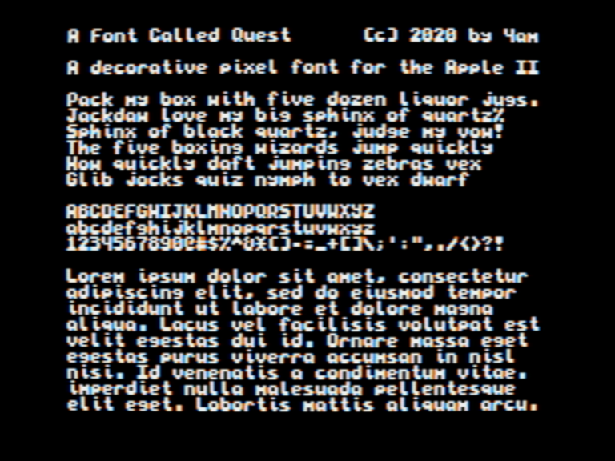

A Font Called Quest: a `monospaced` decorative sans serif pixel font designed specifically for the Apple II hi-res screen. Characters are 6x7, always on byte boundary, providing the standard viewable screen of 40x24, as shown. Uppercase + lowercase + numerals + full punctuation.

