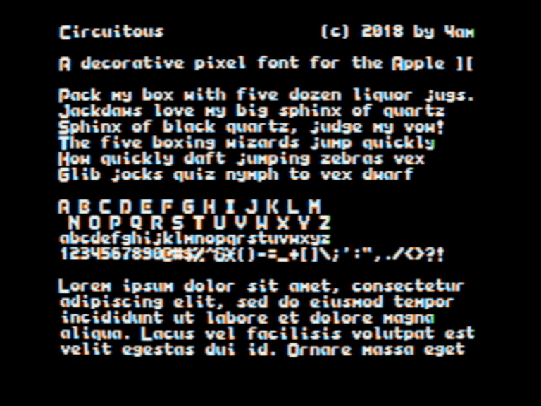

Circuitous: a `monospaced` sans serif pixel font designed specifically for the Apple II hi-res screen.
Uppercase letters are 7x8; lowercase and numerals are 6x7.
Uppercase + lowercase + numerals + full punctuation + some glyphs.
Uppercase letters intentionally bleed into each other unless you add an additional byte of horizontal spacing.

