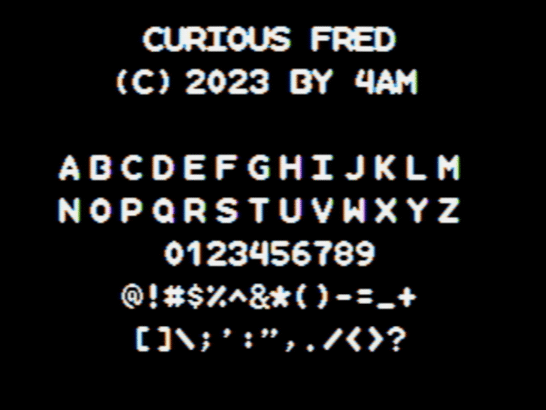

Curious Fred: a `monospaced` sans serif pixel font designed specifically for the Apple II hi-res screen. Characters are 14x14, so double-width, double-height including two lines of vertical spacing, always on byte boundaries and easy-to-calculate HGR base addresses. Uppercase + numerals + full punctuation. Letters intentionally bleed into each other unless you add an additional byte of horizontal spacing, as shown. Numerals and punctuation are slightly narrower. Inspired by [Fredoka](https://fonts.google.com/specimen/Fredoka).

As seen in [Word Clock](https://github.com/a2-4am/word-clock)

