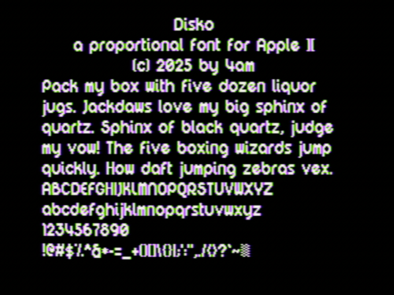

Disko: a proportional sans serif pixel font for the Apple II hi-res screen. It is based on ["Digital Disco" by jeti](https://www.dafont.com/digital-disco.font) but with tweaks to most characters to reduce color fringing or adjust widths and shapes. Characters are up to 13x8. Open source proportional font rendering engine included. Uppercase + lowercase + numerals + full punctuation.

