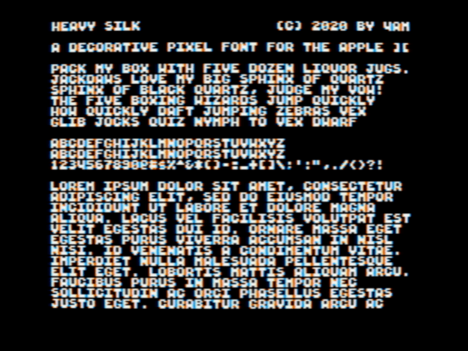

Heavy Silk: a `monospaced` decorative sans serif pixel font designed specifically for the Apple II hi-res screen. Characters are 6x6,
always on byte boundary, providing a viewable screen of 40x28, as shown. Uppercase + numerals + full punctuation.

As seen in [Million Perfect Letters](https://github.com/a2-4am/million-perfect-letters)

