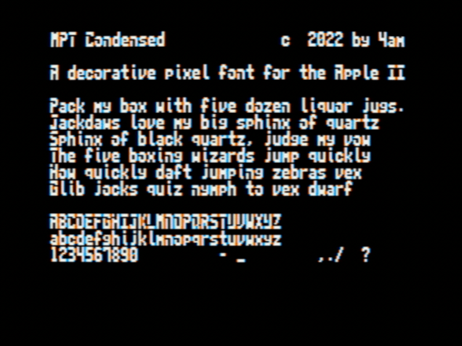

MPT Condensed: a `monospaced` decorative sans serif pixel font designed specifically for the Apple II hi-res screen. Characters are 6x10, always on byte boundary, providing a viewable screen of 40x16, as shown. Uppercase + lowercase + numerals + limited punctuation.

As seen in [Million Perfect Tiles](https://github.com/a2-4am/million-perfect-tiles)

