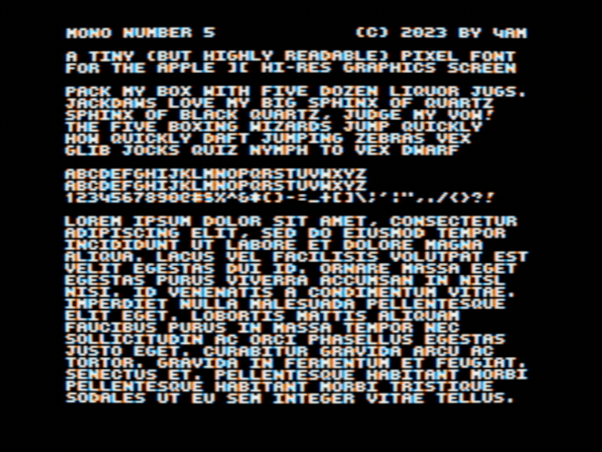

Mono Number 5: a `monospaced` sans serif pixel font designed specifically for the Apple II hi-res screen. Characters are 6x5, always on byte boundary, providing a viewable screen of 40x32, as shown. Very few single-pixel edges or terminals, to minimize color fringing. Uppercase + numerals + full punctuation.

As seen in [Wizard Replay](https://archive.org/details/WizardReplay)

