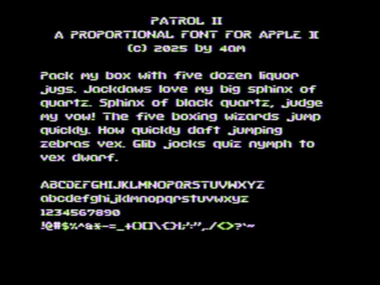

Patrol II: a proportional sans serif pixel font for the Apple II hi-res screen. It is based on ["Patrol Bold" by Damien Guard](https://damieng.com/typography/zx-origins/patrol/) but with taller capitals and several tweaks to reduce color fringing. Characters are up to 8x7. Open source proportional font rendering engine included. Uppercase + lowercase + numerals + full punctuation.

