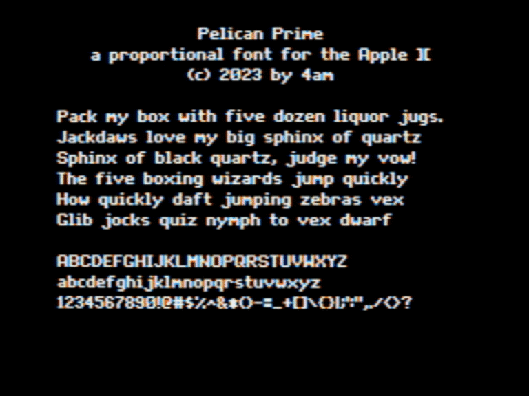

Pelican Prime: a proportional sans serif pixel font designed specifically for the Apple II hi-res screen. This is a recreation of the font used in SuperPrint II by Pelican Software. Characters are up to 7x9. New, original, open source proportional font rendering engine included. Uppercase + lowercase + numerals + full punctuation.

