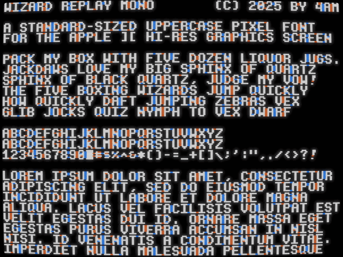

Wizard Replay Mono: a `monospaced` sans serif pixel font designed specifically for the Apple II hi-res screen.
Characters are 6x7, always on byte boundary, providing the standard viewable screen of 40x24, as shown.
Very few single-pixel edges or terminals, to minimize color fringing.
Uppercase only + numerals + full punctuation except `@` sign.

As seen in [Wizard Replay](https://github.com/a2-4am/wizard-replay)

